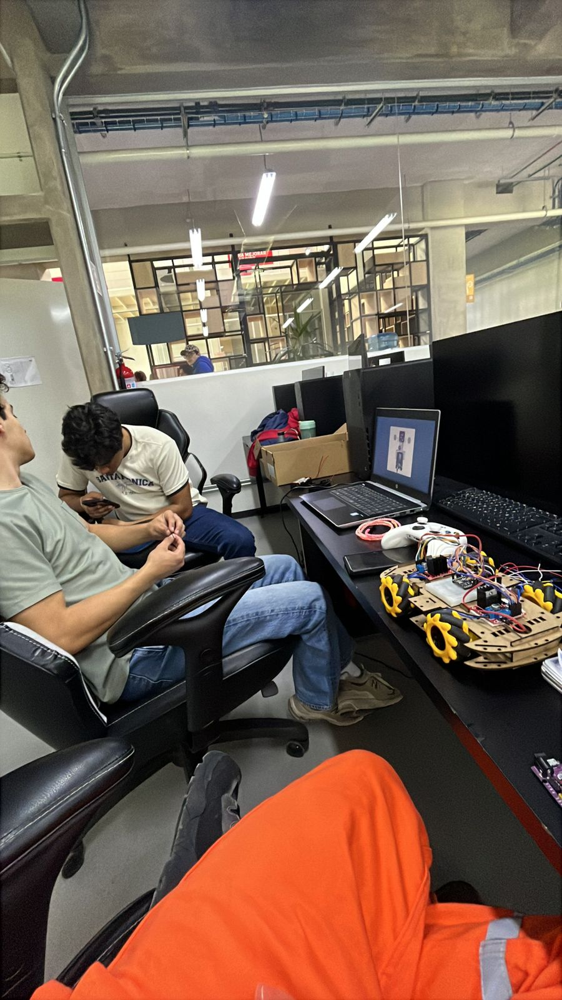

# **Página Web Bitácora**

Soy Sebastián Sánchez Escobar, estudió ingeniería Mecatrónica en la Ibero Puebla, voy en primer semestre, me gustaría aprender más sobre la automatización e industria 4.0. Me gusta escuchar música, entrenar y salir con mis amigos. 

Me siento orgulloso de la disciplina que he construido y he desmostrado en varias ocasiones, gracias a este esfuerzo he desarrollado y mantenido buenos hábitos que mejoran mi vida.

Mi correo es: 196866@iberopuebla.mx 


# **Trabajos/Proyectos**
### **Controlar luz LED por Bluetooth.**
<video controls>
  <source src="recursos/imgs/ControlarLEDBluetooth.mp4" type="video/mp4">
</video>
En este trabajo controlamos el encendido y apagado de una luz LED con un teléfono mediante Bluetooth.
Ocupamos: Protoboard, ESP 32, LED.


### **Controlar luz LED con boton.**
<video controls style="width: 50%; max-width: 300px;">
  <source src="recursos/imgs/PXL_20250912_163927244.TS(1).mp4" type="video/mp4">
</video>
En este trabajo controlamos el encendido y apagado de una luz LED con un botón.
Ocupamos: Protoboard, ESP 32, LED, botón.

### **Cambio de giro de motor**
<video controls style="width: 75%; max-width: 300px;">
  <source src="recursos/imgs/cambio-giro-motor.mp4" type="video/mp4">
</video>
En este trabajo controlamos la dirección de giro de un motor.
Ocupamos: Protoboarb, ESP 32, Puente H, Motorreductor TT.

### **Cambio gradual de velocidad de motor**
<video controls style="width: 75%; max-width: 300px;">
  <source src="recursos/imgs/cambio-gradual-giro-motor.mp4" type="video/mp4">
</video>
Aqui el mismo circuito que en el trabajo pasado, pero cambiamos el código del ESP32 para que gradualmente cambie la velocidad.

### **Servomotor ciclo 0°-10°-0°-20°-0°-30°... hasta 180°**
<video controls style="width: 75%; max-width: 800px;">
  <source src="recursos/imgs/servomotor-ciclo-0-10-0-20.mp4" type="video/mp4">
</video>
En este trabajo hicimos que un servomotor fuera aumentando de 10° en 10° pero regresando a 0° entre cada subida.
Ocupamos: Protoboarb, ESP 32, servomotor.

## **PROYECTO: Coche a control remoto Bluetooth**
     

En este proyecto construimos un coche a control remoto Bluetooth. El material que usamos para el coche:    
- 4 Motorreductores TT    
- 4 Llantas Omnidireccionales    
- 2 Puentes H  
- 1 Protoboard   
- 1 ESP 32  
- Jumpers  
- 2 Pilas  
- Control Xbox  
Las 2 Pilas se conectan para alimentar todo el sistema. Los Puentes H se usan para poder controlar los 4 motores TT (1 Puente H por 2 motores TT), cada Puente H controla la dirección y velocidad de dos motores a la vez.   
El ESP32 se pone en la Protoboard y se conecta a las entradas de los Puentes H usando Jumpers.    
El código dentro del ESP32 está configurado para conectarse al control Xbox, luego lee el movimiento del joystick y dependiendo de la dirección del joystick se activa una función para que los motores se activen de manera específica para moverse en esa dirección.  
   


### ** Código Python cámara parte 1 **

En este trabajo logramos iniciar la cámara en python, modificar los colores y dibujar líneas y circulos.
   ```python
import cv2
import numpy as np

video = cv2.VideoCapture(0)


#centrox=0
#centroy=0


while True:

    ret, img = video.read()

    #img2 = cv2.cvtColor(img, cv2.COLOR_BGR2RGB)
    #img3 = cv2.cvtColor(img, cv2.COLOR_RGB2BGR)
    #img4 = cv2.cvtColor(img, cv2.COLOR_BGR2GRAY)

    if not ret:
        break


    cv2.imshow("Mivideo",img)


    #DIBUJAR COSAS
    #draw = img.copy ()
    #LINEA
    #cv2.line(draw,(0,0),(100,100),(0,0,255),thickness=3, lineType=cv2.LINE_AA)
    #CIRCULO
    #cv2.circle(draw,(centrox,centroy),50,(0,0,255),thickness=3, lineType=cv2.LINE_AA)
    #cv2.imshow("Mivideodraw",draw)
    #centrox=centrox+1
    #if centrox<300:
    #    centrox=centrox+1
    #else:
    #    centrox=0


    #CAMBIOS DE COLORES
    #imgCopia = img.copy()
    #imgCopia[:, :, 1] = 0
    #imgCopia[:, :, 0] = 0
    #imgCopia[0:300, 0:300, 2] = 0
    
    #MOSTRAR IMAGEN
    #cv2.imshow("Mivideo1",img2)
    #cv2.imshow("Mivideo2",img3)
    #cv2.imshow("Mivideo3",img4)
    #cv2.imshow("Mivideo",no_blue)
    if cv2.waitKey(1) & 0xFF == ord('q'):
        break

video.release()
cv2.destroyAllWindows()

```


