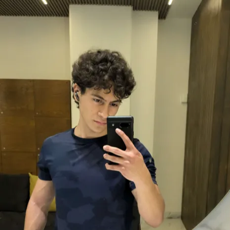

# Página Web Bitácora

Soy Sebastián Sánchez Escobar, estudió ingeniería Mecatrónica en la Ibero Puebla, voy en primer semestre, me gustaría aprender más sobre la automatización e industria 4.0. Me gusta escuchar música, entrenar y salir con mis amigos. 

Me siento orgulloso de la disciplina que he construido y he desmostrado en varias ocasiones, gracias a este esfuerzo he desarrollado y mantenido buenos hábitos que mejoran mi vida.

Mi correo es: 196866@iberopuebla.mx 

# Trabajos/Proyectos
## **Controlar luz LED por Bluetooth.**
<video controls>
  <source src="recursos/imgs/ControlarLEDBluetooth.mp4" type="video/mp4">
</video>

## **Controlar luz LED con boton.**
<video controls style="width: 50%; max-width: 400px;">
  <source src="recursos/imgs/PXL_20250912_163927244.TS(1).mp4" type="video/mp4">
</video>

## **Cambio de giro de motor**
<video controls style="width: 75%; max-width: 400px;">
  <source src="recursos/imgs/cambio-giro-motor.mp4" type="video/mp4">
</video>

## **Cambio gradual de velocidad de motor**
<video controls style="width: 75%; max-width: 400px;">
  <source src="recursos/imgs/cambio-gradual-giro-motor.mp4" type="video/mp4">
</video>

## **Servomotor ciclo 0-10-0-20-0-30... hasta 180**
<video controls style="width: 75%; max-width: 800px;">
  <source src="recursos/imgs/servomotor-ciclo-0-10-0-20.mp4" type="video/mp4">
</video>

